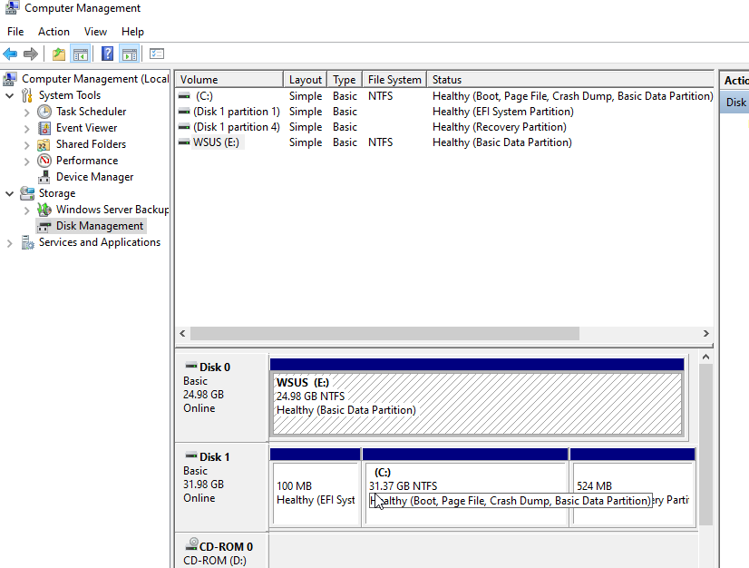
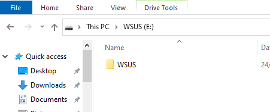
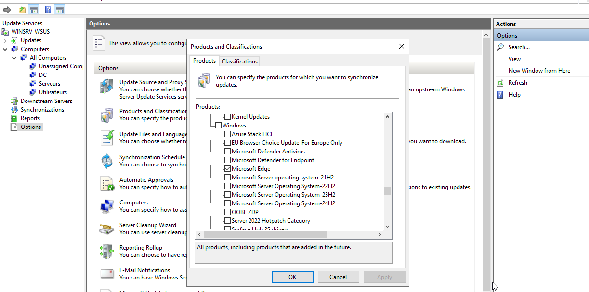
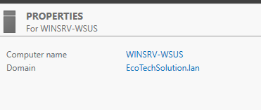

## Guide d’installation et configuration – Serveur WSUS et des rôles FSMO sur les DC - Ecotech Solutions

## Sommaire

1. [Mise en place du serveur WSUS](#Srv-WSUS)  
     [Partie 1 - Intégration du serveur WSUS au domaine](#WSUS-AD)  
     [Partie 2 - Liaison des groupes](#liaison-groupes)  
     [Partie 3 - Liaison des MAJ](#liaison-maj)  
      - [A - Les clients](#maj-clients)  
      - [B - Les serveurs](#maj-serveurs)  
      - [C - Les DC](#maj-dc)  
2. [Rôles FSMO](#fsmo)  


## 1.Mise en place du serveur WSUS  
<span id="Srv-WSUS"/><span>  

Nous avons créer une nouvelle machine en faisant un clone intégrale d'un serveur Windows Server 2022. 
Sur cette machine, nous avons rajouter un deuxieme disque dure de 25 Go consacré au rôle WSUS. 
Pour l'activer, nous avons utilisé **Computeur Management** dans **Tools**. Puis aller dans **Disk Management**. Visualise le nouveau disque, clique droit **Simple Volume** puis suivant jusqu'a **Finish**. 



Une fois le disque opérationnel, créer un dossier **WSUS** dessus.



À partir du **Server Manager**, installe le rôle **Windows Server Update Services**. Valide les fonctionnalités supplémentaires qui vont s'ajouter automatiquement. Indique le dossier que tu as créer pour l'emplacement du stockage des mises à jour.
Termine l'installation et redémarre le serveur. 

Quand le serveur est redémarré, clique sur l'icône avec le panneau orange sur **Server Manager** et lance la tâche **Post Deployment Configuration for WSUS**.

Une fois fait, va dans **Windows Server Update Services** via **Tools** du **Server Manager**. Clique sur **Next** jusqu'a **Start Connecting**. 

Après, sélectionne les langues **English** et **French**. 
Dans la fenêtre d'après, sélectionne les produits pour lesquels tu souhaites avoir des mises à jour. Ici nous avons choisit peu de mise a jour pour pouvoir synchroniser les machines rapidements : 



Il suffit ensuite de choisir combien de synchronisation on souhaite faire. Ici nous avons choisit 4 synchonisations par jour.
Enfin coche la case **Begin initial synchronization**. 


### Partie 1 - Intégration du serveur WSUS au domaine  
<span id="WSUS-AD"/><span>  

Nous l'avons ensuite intégrer au domaine EcoTechSolution (pour rappel, pour intégrer un domaine il faut être sur le même réseau, et changer le nom de domaine sur **Server Manager** et utiliser le compte **Administrator** avec mot de passe **Azerty1*** pour intégrer le domaine)


  
  
### Partie 2 - Liaison des groupes  
<span id="liaison-groupes"/><span>  


  


### Partie 3 - Liaison des MAJ  
<span id="liaison-maj"/><span>    
  
  


## 2.Rôles FSMO  
<span id="fsmo"/><span>  

#### Création serveur Windows Core 

Nous avons créer deux autres serveurs Windows Core pour avoir trois Domain Controler sur notre domaine AD.
Pour les mettres en DC, il a fallu leur attribuer une IP pour qu'elles fassent partie du réseau de l'AD (grâce au rôle DHCP cela c'est fait automatiquement).
Puis rensigner le nom de domaine pour leur faire intégrer notre AD **EcoTechSolution.lan**.


#### Distributions des rôles FSMO

Une fois que nous avons nos trois DC sur notre AD ( 1 GUI et 2 CLI), nous avons réparties les rôles FSMO entre eux.  
Pour ce faire nous avons utilisé l'utilitaire **ntdsutil.exe**.
Pour accéder a cet outil, il suffit d'utiliser la console PowerShell. Ici nous allons l'utiliser sur notre serveur Windows GUI.
```PowerShell
ntdsutil.exe
```

Une fois l'utilitaire lancée, nous allons passé en mode **fsmo maintenance** : 
```PowerShell
role
```

Maintenant nous allons établir une connexion avec le serveurs sur lequel on veut transférer un ou des rôles : 
```powershell
connections
```

Nous sommes maintenant en mode **server connections**, nous allons nous connecter à un serveur Windows Core : 

```powershell
connect to server WINCORESRV-ADDS
```

Enfin nous allons transférer le rôle FSMO **RID Master** a ce serveur : 
```powershell
transfert RID master
```


Une fois cela fait nous allons faire de même avec notre deuxieme serveur Windows Core et lui attribuer le rôle FSMO **Emulateur PDC**


Pour finir nous allons vérifier si tout à été bien configurer : 


