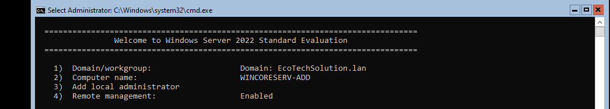
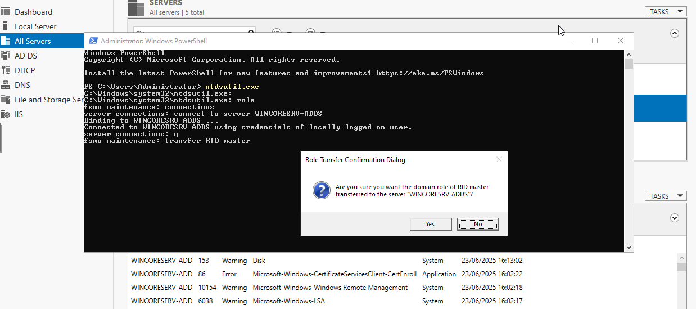
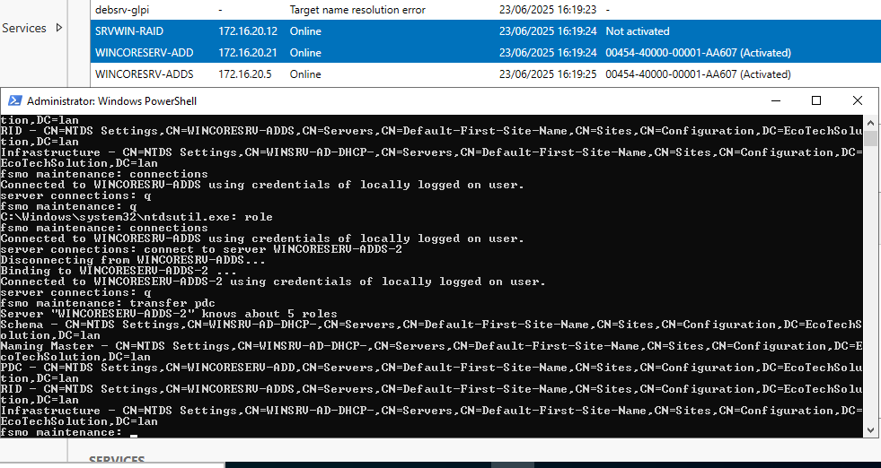
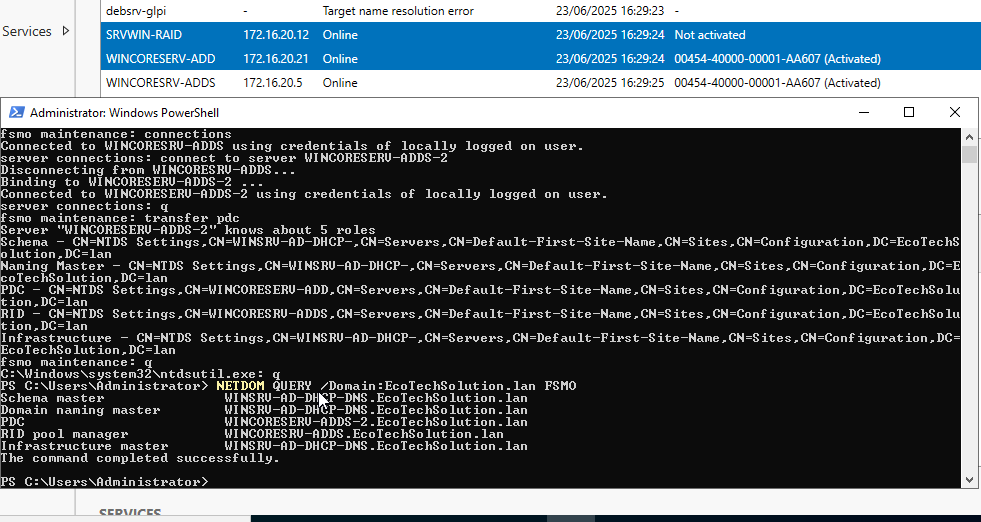

## Guide d’installation et configuration – Serveur WSUS et des rôles FSMO sur les DC - Ecotech Solutions

## Sommaire

1. [Mise en place du serveur WSUS](#Srv-WSUS)  
     [Partie 1 - Intégration du serveur WSUS au domaine](#WSUS-AD)  
     [Partie 2 - Liaison des groupes](#liaison-groupes)  
     [Partie 3 - Liaison des MAJ](#liaison-maj)  
      - [A - Les clients](#maj-clients)  
      - [B - Les serveurs](#maj-serveurs)  
      - [C - Les DC](#maj-dc)  
2. [Rôles FSMO](#fsmo)  


## 1.Mise en place du serveur WSUS  
<span id="Srv-WSUS"/><span>  
  
### Partie 1 - Intégration du serveur WSUS au domaine  
<span id="WSUS-AD"/><span>  

  
  
  
### Partie 2 - Liaison des groupes  
<span id="liaison-groupes"/><span>  


  


### Partie 3 - Liaison des MAJ  
<span id="liaison-maj"/><span>    
  
  


## 2.Rôles FSMO  
<span id="fsmo"/><span>  

#### Création serveur Windows Core 

Nous avons créer deux autres serveurs Windows Core pour avoir trois Domain Controler sur notre domaine AD.
Pour les mettres en DC, il a fallu leur attribuer une IP pour qu'elles fassent partie du réseau de l'AD (grâce au rôle DHCP cela c'est fait automatiquement).
Puis rensigner le nom de domaine pour leur faire intégrer notre AD **EcoTechSolution.lan**.



#### Distributions des rôles FSMO

Une fois que nous avons nos trois DC sur notre AD ( 1 GUI et 2 CLI), nous avons réparties les rôles FSMO entre eux.  
Pour ce faire nous avons utilisé l'utilitaire **ntdsutil.exe**.
Pour accéder a cet outil, il suffit d'utiliser la console PowerShell. Ici nous allons l'utiliser sur notre serveur Windows GUI.
```PowerShell
ntdsutil.exe
```

Une fois l'utilitaire lancée, nous allons passé en mode **fsmo maintenance** : 
```PowerShell
role
```

Maintenant nous allons établir une connexion avec le serveurs sur lequel on veut transférer un ou des rôles : 
```powershell
connections
```

Nous sommes maintenant en mode **server connections**, nous allons nous connecter à un serveur Windows Core : 

```powershell
connect to server WINCORESRV-ADDS
```

Enfin nous allons transférer le rôle FSMO **RID Master** a ce serveur : 
```powershell
transfert RID master
```



Une fois cela fait nous allons faire de même avec notre deuxieme serveur Windows Core et lui attribuer le rôle FSMO **Emulateur PDC**



Pour finir nous allons vérifier si tout à été bien configurer : 




