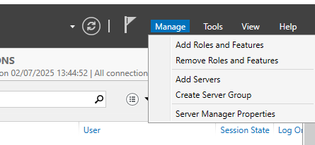
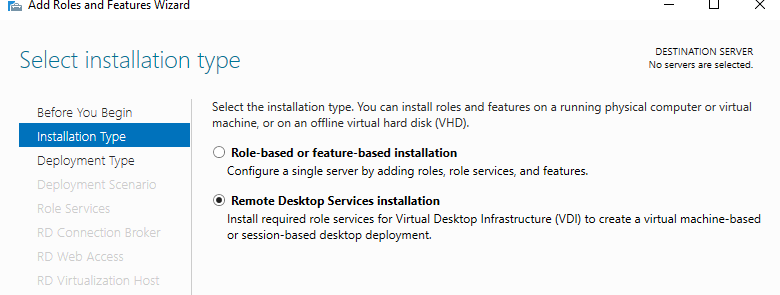
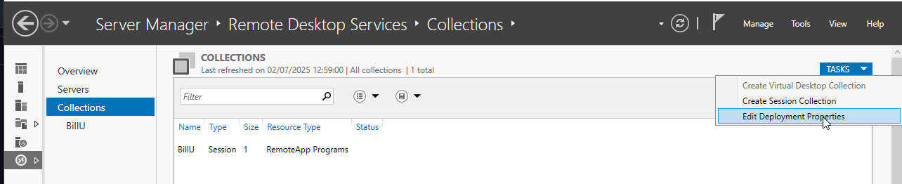

## Guide d’installation et configuration – Serveur Bastion, VPN, Serveur RDS

## Sommaire

1. [Installation et configuration du serveur Bastion avec Apache Guacamole](#Srv-Bastion)

     [A - Installer les prérequis d'Apache Guacamole](pré-requis)  
     [B - Compiler et installer Apache Guacamole "Server"](#pré-requis2)  
     [C - Créer le répertoire de configuration](#Répertoire)  
     [D - Installer Guacamole Client (Web App)](#Guacamole-client)  
     [E - Base de données MariaDB pour l'authentification](#MariaDB)   
     [F - Configuration depuis l'interface Web](#webapp)       
     [G - Ajout d'une connexion RDP](#RDP)  
     [H - Ajout d'une connexion SSH](#SSH)  
     [I - Résolution erreur fréquente](#debogage)

2. [Configuration d'IPSEC sur pfSense](#IPSEC)

     [A - Configuration de la connexion WAN](#WAN)  
     [B - Configuration de la connexion LAN](#LAN)  
     [C - Actions finales et règles de pare-feu](#end)  

3. [Installation et configuration d'une VM RServeur Windows RDP](#RDP)

---


## 1 - Installation et configuration du serveur Bastion avec Apache Guacamole
<span id="Srv-Bastion"/><span> 

Dans ce guide, nous allons apprendre à installer et configurer Apache Guacamole, une solution open source et gratuite que l'on peut mettre en place en tant que bastion d'administration, passerelle d'accès ou encore serveur de rebond. Une machine sous Debian 12 sera utilisée pour héberger l'application. L'hôte Apache Guacamole est positionné en DMZ puisqu'il doit être accessible depuis l'extérieur.  
Apache Guacamole devient un élément central de l'infrastructure puisqu'il sert de passerelle pour administrer les machines. 

### A - Installer les prérequis d'Apache Guacamole  
<span id="pré-requis"/><span>  


**NB**:_Pour l'installation nous sommes en Root, si vous êtes sur un comptes utilisateur, vous devez installer **sudo** puis ajouter l'utilisateur pour avoir la permission sur les commandes. Pensez à rajouter **sudo** devant les commandes qui vont suivre._


Nous devons commencer par installer les paquets indispensable au fonctionnement d'**Apache Guacamole**, pour cela sur votre machine Debian executé les commandes suivantes puis attendez la fin de l'installation :

```
apt-get update
apt-get install build-essential libcairo2-dev libjpeg62-turbo-dev libpng-dev libtool-bin uuid-dev libossp-uuid-dev libavcodec-dev libavformat-dev libavutil-dev libswscale-dev freerdp2-dev libpango1.0-dev libssh2-1-dev libtelnet-dev libvncserver-dev libwebsockets-dev libpulse-dev libssl-dev libvorbis-dev libwebp-dev
```


### B - Compiler et installer Apache Guacamole "Server"  
<span id="pré-requis2"/><span>  

- La partie "Server" d'Apache Guacamole doit être téléchargée et compilée en local pour s'installer. Nous utiliserons la dernière version à ce jour , à savoir la version 1.6.0. Pour identifier la dernière version, nous pouvons nous appuyer sur ce lien :


[Historique des versions d'Apache Guacamole](https://guacamole.apache.org/releases/)


- On se positionne dans le répertoire "/tmp" et on télécharge l'archive tar.gz avec la commande :


```
cd /tmp
wget https://downloads.apache.org/guacamole/1.5.5/source/guacamole-server-1.5.5.tar.gz
```

- Une fois le téléchargement terminé, on décompresse l'archive tar.gz et on se positionne dans le répertoire obtenu :
```
tar -xzf guacamole-server-1.6.0.tar.gz
cd guacamole-server-1.6.0/
```
- On prépare ensuite la compilation pour vérifier la présences des dépendances installer précédémment :
```
sudo ./configure --with-systemd-dir=/etc/systemd/system/
```
- Vous devriez avoir toutes les dépendances avec le status **YES** comme ceci : 


- Une fois que tout est Ok, poursuivez avec la compilation du code source de Guacamole-Server:
```
Make
```

- On installe ensuite le composant Guacamole Server :
```
Make Install
```


> **La partie serveur d'Apache Guacamole est installée**, il reste cependant quelques étapes à réalisée


- Il faut mettre a jours les liens entre guacamole-server et les librairies avec ``sudo ldconfig``


- On démarre le service **"guacd"** et on active son démarrage automatique :
```
sudo systemctl daemon-reload
sudo systemctl enable --now guacd
```

- Vérifiez le statut d'Apache Guacamole Server : ``sudo systemctl status guacd``


### C - Créer le répertoire de configuration  
<span id="Répertoire"/><span>  

- Nous allons crée l'arborescence pour la configuration d'Apache Guacamole. Cela va donner le répertoire ``"/etc/guacamole"`` avec les sous-répertoires ``"extensions"`` et ``"lib"`` nécéssaire pour le stockage des données dans une base de données **MariadDB/MySQL**.


```
sudo mkdir -p /etc/guacamole/{extensions,lib}
```

### D - Installer Guacamole Client (Web App)  
<span id="Guacamole-client"/><span>  

- Pour la **Web App** correspondante à Apache Guacamole, et donc à la partie cliente, nous avons besoin d'un serveur **Tomcat 9**. Attention **Tomcat 10**, distribué par défaut via les dépôts de Debian 12, n'est pas pris en charge par Apache Guacamole. Nous devons ajouter le dépôt de Debian 11 sur notre machine Debian 12 afin de pouvoir télécharger les paquets correspondants à Tomcat 9.
- Nous allons donc ajouter un nouveau fichier source pour Apt. Créez le fichier suivant :


```
sudo nano /etc/apt/sources.list.d/bullseye.list 
# Ajoutez cette ligne :
deb http://deb.debian.org/debian/ bullseye main
# Enregistrez et fermez le fichier.
```

- Mettez ensuite à jour le cache des paquets avec ``sudo apt-get update``


- Effectuez l'installation des paquets Tomcat 9 sur Debian 12 avec cette commande :
```
sudo apt-get install tomcat9 tomcat9-admin tomcat9-common tomcat9-user
```


- Nous allons ensuite télécharger la dernière version de la Web App d'Apache Guacamole depuis le dépôt officiel. On se positionne dans **"/tmp"** et on télécharge la **Web App**, ce qui revient à télécharger un fichier avec l'extension ".war". Ici, la version 1.6.0 est téléchargée.

```
cd /tmp
wget https://downloads.apache.org/guacamole/1.6.0/binary/guacamole-1.6.0.war
```

- Une fois téléchargé, on le déplace dans la librairie de Web App de Tomcat9 avec :
```
sudo mv guacamole-1.6.0.war /var/lib/tomcat9/webapps/guacamole.war
# On relance ensuite les services Tomcat9 et Guacamole
sudo systemctl restart tomcat9 guacd
```

> Voilà, Apache Guacamole Client est installé !


### E - Base de données MariaDB pour l'authentification  
<span id="MariaDB"/><span>  

- Nous allons maintenant déployer MariaDB Server (ou MySQL Server, au choix) sur Debian pour qu'Apache Guacamole s'appuie sur une base de données. Elle sera utilse pour stocker toutes les informations de l'application.

> On installe le paquet MariaDB Server
```
sudo apt-get install mariadb-server
```

> Puis, on exécute le script ci-dessous pour sécuriser un minimum notre instance (changer le mot de passe root, désactiver les accès anonymes, etc...). Rentrez la configuration que vous voulez pour votre base de données.
```
sudo mysql_secure_installation
```

> Une fois cette étape effectuée, on va se connecter en tant que root à notre instance MariaDB :
```
mysql -u root -p
```

Nous allons maintenant créer la base de données "guacadb" avec l'utilisateur "Lucia_Morel" associé au mot de passe Azerty1* (vous devez adaptez ces valeurs), Cet utilisateur dispose de quelques droits sur la base de données.


```
CREATE DATABASE guacadb;
CREATE USER 'Lucia_Morel'@'localhost' IDENTIFIED BY 'Azerty1*';
GRANT SELECT,INSERT,UPDATE,DELETE ON guacadb.* TO 'Lucia.Morel'@'localhost';
FLUSH PRIVILEGES;
EXIT;
```


- On va maintenant télécharger l'extension MySQL pour Apache Guacamole : 
```
cd /tmp
wget https://downloads.apache.org/guacamole/1.6.0/binary/guacamole-auth-jdbc-1.6.0.tar.gz
# On décompresse l'archive tar.gz
tar -xzf guacamole-auth-jdbc-1.6.0.tar.gz
# On déplace le fichier ".jar" dans le répertoire "/etc/guacamole/extensions/"
sudo mv guacamole-auth-jdbc-1.6.0/mysql/guacamole-auth-jdbc-mysql-1.6.0.jar /etc/guacamole/extensions/
```

- Ensuite, le connecteur MySQL doit être téléchargé depuis le site de MySQL (peu importe si vous utilisez MariaDB ou MySQL).

- Utilisez le lien ci-dessous pour repérer le lien de la dernière version en choisissant "Platform Independent", puis ajouter le liens entre parenthèse situé en dessous de  "Compressed TAR Archive".
[Connecteur MySQL](https://dev.mysql.com/downloads/connector/j/)


- On lance ensuite le téléchargement 
```
cd /tmp
wget https://dev.mysql.com/get/Downloads/Connector-J/mysql-connector-j-9.3.0.tar.gz
# On décompresse l'archive tar.gz :
tar -xzf mysql-connector-j-9.1.0.tar.gz
# On déplace le fichier .jar du connecteur vers le répertoire "lib" d'Apache Guacamole :
sudo cp mysql-connector-j-9.1.0/mysql-connector-j-9.1.0.jar /etc/guacamole/lib/
```

- Les dépendances sont déployées, mais nous n'avons pas encore fini cette intégration avec MariaDB. Il faut importer la structure de la base de données Apache Guacamole dans notre base de données **"guacadb"**. Pour cela, on va importer tous les fichiers SQL situés dans le répertoire **"guacamole-auth-jdbc-1.6.0/mysql/schema/"**

```
cd guacamole-auth-jdbc-1.6.0/mysql/schema/
cat *.sql | mysql -u root -p guacadb
```

- Une fois que c'est fait, on va créer et éditer le fichier "guacamole.properties" pour déclarer la connexion à MariaDB. Ce fichier peut être utilisé pour d'autres paramètres, selon vos besoins.
```
sudo nano /etc/guacamole/guacamole.properties
```

- Dans ce fichier, insérez les lignes ci-dessous en adaptant les trois dernières lignes avec vos valeurs :
```
# MySQL
mysql-hostname: 127.0.0.1
mysql-port: 3306
mysql-database: guacadb
mysql-username: Lucia_Morel 
mysql-password: Azerty1*
# Enregistrez et fermez le fichier
```

- Editez le fichier **"guacd.conf"** pour déclarer le serveur Guacamole (ici, on déclare une connexion locale sur le port par défaut, à savoir 4822).

```
sudo nano /etc/guacamole/guacd.conf
```
- Puis rentrez ceci dans le fichier :
```
[server] 
bind_host = 0.0.0.0
bind_port = 4822
```

- On enregistre et on termine par redémarrer les trois services liés à Apache Guacamole :

``sudo systemctl restart tomcat9 guacd mariadb``

##### l'installation de base est terminée !


### F - Configuration depuis l'interface Web  
<span id="webapp"/><span>  

- Connectez vous à Apache Guacamole via :

```
http://<Adresse IP>:8080/guacamole/
```

- Vous devriez arrivez sur cette page :


- Utiliser les identifiants par défaut :
  - Utilisateur = **guacadmin**
  - Mot de passe = **guacadmin**


- Une fois connecté, nous allons créer un nouveau compte d'administration et supprimer le compte par défaut, pour des raisons de sécurité.
- Pour accéder aux paramètres, il faut cliquer sur le nom d'utilisateur en haut à droite puis sur "Paramètres".


- Ensuite, allez sur l'onglet **"Utilisateurs"** et sur **"Nouvel utilisateur"**.


- Un formulaire s'affiche. Adaptez vos valeurs en indiquant un nom d'utilisateur et choisissez un mot de passe robuste. Cochez l'ensemble des permissions pour que cet utilisateur soit administrateur de la plateforme Guacamole.


- Nous allons maintenant que le nouveau compte est crée, supprimé le compte par défaut guacadmin pour cela :
- Retournez dans **Paramètres > Utilisateur puis séléctionner le compte guacadmin**, dérouler la page jusqu'en bas ou vous pourrez cliquez sur le bouton **Supprimer**


### G - Ajout d'une connexion RDP  
<span id="RDP"/><span>  

> Nous allons créer notre première connexion dans Apache Guacamole, de manière à se connecter à un serveur en RDP !

- Mais avant cela, on va créer un nouveau groupe, car ces groupes vont permettre d'organiser les connexions : ``Paramètres > Connexion > Nouveau groupe``

> Dans cet exemple, je crée un groupe nommé "Windows". Il sera positionné sous le lieu **"ROOT"** qui est la racine de l'arborescence. Le type de groupe > **"Organizationel"** doit être sélectionné pour tous les groupes qui ont pour vocation à organiser les connexions.


On enregistre et on clique sur le bouton **"Nouvelle connexion"**. On commence par nommer la connexion, choisir le groupe et le protocole. Ici, c'est sur le serveur **"WINSRV-AD-DHCP-DNS"** que je souhaite me connecter, associé à l'adresse IP **"172.16.20.3".**

- Pour créer une nouvelle connexion : ``Paramètres > Connexion > Nouvelle connexion``


- Ensuite, il y a un ensemble de paramètres à renseigner :
  - **Nom d'hôte** : le nom DNS du serveur (si le serveur Apache Guacamole est capable de résoudre le nom), sinon l'adresse IP
  - **Port** : le numéro de port du RDP, par défaut 3389 (pas utile de le préciser si c'est le port par défaut)
  - **Identifiant** : compte avec lequel s'authentifier sur le serveur
  - **Mot de passe** : mot de passe du compte spécifié ci-dessus
  - **Nom de domaine** : nom du domaine Active Directory, si besoin
  - **Mode de sécurité** : par défaut, c'est en détection automatique (vous pouvez également choisir le NLA)
  - **Ignorer le certificat du serveur** : cochez cette option si vous n'avez pas déployé de certificat pour vos connexions RDP et si vous utilisez une adresse IP pour la connexion
  - **Agencement clavier** : choisissez "Français (Azerty)", ou adaptez selon votre configuration
  - **Fuseau horaire** : choisissez "Europe / Paris", ou adaptez selon votre configuration


> Il y a de nombreuses options disponibles, notamment pour faire remonter les périphériques locaux, ou passer par une passerelle de bureau à distance. Au début, il faut > passer du temps à trouver la bonne formule pour que la connexion RDP intègre toutes les fonctions dont on a besoin. Toutefois, si l'on veut simplement se connecter et avoir le contrôle à distance, ce n'est pas utile de modifier profondément la configuration.
Pour que l'expérience soit un peu plus agréable, on peut cocher les options ci-dessous (mais cela reste facultatif - testez avec et sans) :


- Une fois configuré comme voulu, **enregistrez**.La nouvelle connexion apparaît sous **"Windows"**. Pour tester cette connexion, il faut basculer sur **"Accueil"* en cliquant sur son identifiant en haut à droite.


- Dans l'accueil, l'utilisateur peut visualiser toutes les connexions qu'il a le droit d'utiliser.


- Il suffit de cliquer sur le serveur et la connexion va se lancer...


- Voilà, je suis connecté en Bureau à distance via le protocole RDP à mon serveur en passant par mon serveur Apache Guacamole ! Si ça ne fonctionne pas, **lisez la partie suivante de ce guide**. Voici un exemple de connexion RDP via Guacamole, sur une machine sous Windows Server 2022.


### H - Ajout d'une connexion SSH  
<span id="SSH"/><span>  

- La connexion SSH ce fait de la même manière que la connexion RDP ci-dessus, à la seul différence que les paramètres à rentrées sont légèrements différents avec notamment le port **22** à renseigner au lieu du port **3389**


- Renseignez l'utilisateur avec lequel vous voulez vous connectez en SSH avec son mot de passe, ou bien la clé SSH si vous utilisé une clé de chiffrement pour la connexion.


### I - Résolution erreur fréquente  
<span id="debogage"/><span>  

**Que faire si la connexion RDP ne se lance pas ou qu'elle affiche une erreur ?**

- Retournez sur la ligne de commande de votre serveur et vérifiez les dernières lignes de logs qui s'affichent lorsque l'on regarde le statut du service guacd :

```
sudo systemctl status guacd
```


- Par exemple, on peut trouver ceci :


```
juin 14 20:15:29 srv-guacamole guacd[31120]: Certificate validation failed
juin 14 20:15:29 srv-guacamole guacd[31120]: RDP server closed/refused connection: SSL/TLS connection failed (untrusted/self-signed certificate?)
```
> Si le certificat RDP ne peut pas être vérifié (auto-signé par exemple) et que l'option "Ignorer le certificat du serveur" n'est pas cochée dans les paramètres de la connexion Guacamole, alors cette erreur se produira.


**Une autre erreur que vous pourriez rencontrer si vous avez besoin d'établir des connexions en RDP, c'est celle-ci :**

```
RDP server closed/refused connection: Security negotiation failed (wrong security type?)
```

- Ce problème est lié au compte utilisateur **"daemon"** utilisé par défaut pour exécuter le service **"guacd"**. Vous pouvez le vérifier avec cette commande :

```
sudo ps aux | grep -v grep| grep guacd
# Résultat :
daemon     31513  0.0  0.7 247928 15400 ?        Ss   16:03   0:00 /usr/local/sbin/guacd -f
```

- Nous devons créer un **nouvel utilisateur**, lui associer les permissions nécessaires sur les données d'Apache Guacamole, puis mettre à jour le service et enfin le relancer.

> Voici la série de commandes à exécuter, dans l'ordre :

```
sudo useradd -M -d /var/lib/guacd/ -r -s /sbin/nologin -c "Guacd User" guacd
sudo mkdir /var/lib/guacd
sudo chown -R guacd: /var/lib/guacd
sudo sed -i 's/daemon/guacd/' /etc/systemd/system/guacd.service
sudo systemctl daemon-reload
sudo systemctl restart guacd
```

- Puis, vérifiez l'état du service :
```
sudo systemctl status guacd
```

---

## 2. Configuration d'IPSEC sur pfSense
<span id="IPSEC"/><span> 
Un VPN (Virtual Private Network) Site-to-Site (aussi appellé LAN-to-LAN) est un VPN qui permet de joindre deux réseaux de type LAN distants de manière à faire en sorte qu'ils puissent communiquer comme s'ils étaient sur le même réseau et qu'un simple routeur les séparait. IPSEC (Internet Protocol Security) est un ensemble de protocoles utilisant des algorithmes permettant le transport de données sécurisées sur un réseau. Il se caractérise comme étant un standard ouvert travaillant sur la couche 3 et supportant de multiple algorithmes de chiffrement et d'authentification.  

#### Informations du Tunnel  

**Site A - EcoTechSolution**   

- WAN : 192.168.1.3  
- LAN : 172.16.20.0/24  

**Site B - BillU**  

- WAN : 192.168.1.2  
- LAN : 172.16.10.0/24  

### A - Configuration de la connexion WAN
<span id="WAN"/><span> 

## Étape 1 : Configuration Phase 1

### Sur pfSense Site A (EcoTechSolution)

1. **Accéder à la configuration IPsec**
    - Naviguer vers `VPN` > `IPsec`
    - Cliquer sur `Add P1` pour créer une nouvelle Phase 1
2. **Paramètres généraux**
    - **Description** : `VPN vers BillU`
    - **Interface** : `WAN`
    - **Remote Gateway** : `192.168.1.2`
    - **Key Exchange Version** : `IKEv2`
    - **Internet Protocol** : `IPv4`
3. **Paramètres de Phase 1**
    - **Authentication Method** : `Mutual PSK`
    - **Negotiation Mode** : `Main`
    - **My identifier** : `My IP address`
    - **Peer identifier** : `Peer IP address`  
    - **Pre-Shared Key** : `Azerty1*`  
4. **Algorithmes de chiffrement**  
    - **Encryption Algorithm** : `AES 256`  
    - **Hash Algorithm** : `SHA256`  
    - **DH Group** : `14 (2048 bit)`  
    - **Lifetime** : `28800` secondes  

### Sur pfSense Site B (BillU)  

1. **Accéder à la configuration IPsec**  
    - Naviguer vers `VPN` > `IPsec`  
    - Cliquer sur `Add P1` pour créer une nouvelle Phase 1  
2. **Paramètres généraux**  
    - **Description** : `Tunnel vers EcoTechSolution`  
    - **Interface** : `WAN`
    - **Remote Gateway** : `192.168.1.3`
    - **Key Exchange Version** : `IKEv2`
    - **Internet Protocol** : `IPv4`
  
  

3. **Paramètres de Phase 1**
    - **Authentication Method** : `Mutual PSK`
    - **Negotiation Mode** : `Main`
    - **My identifier** : `My IP address`
    - **Peer identifier** : `Peer IP address`
    - **Pre-Shared Key** : `Azerty1*` (identique au Site A)


4. **Algorithmes de chiffrement**
    - **Encryption Algorithm** : `AES 256`
    - **Hash Algorithm** : `SHA256`
    - **DH Group** : `14 (2048 bit)`
    - **Lifetime** : `28800` secondes

  

### B - Configuration de la connexion LAN
<span id="LAN"/><span> 

## Étape 2 : Configuration Phase 2

### Sur pfSense Site A (EcoTechSolution)

1. **Créer la Phase 2**
    - Après avoir sauvegardé la Phase 1, cliquer sur `Show Phase 2 Entries`
    - Cliquer sur `Add P2` pour créer une nouvelle Phase 2
2. **Paramètres généraux**
    - **Description** : `VPN-BillU`
    - **Mode** : `Tunnel IPv4`
    - **Local Network** : `LAN subnet` (172.16.20.0/24)
    - **Remote Network** : `Network` avec `172.16.10.0/24`
3. **Paramètres de Phase 2**
    - **Protocol** : `ESP`
    - **Encryption Algorithms** : `AES 128 GSM`
    - **Hash Algorithms** : `SHA256`
    - **PFS Key Group** : `14 (2048 bit)`
    - **Lifetime** : `3600` secondes

### Sur pfSense Site B (BillU)

1. **Créer la Phase 2**
    - Après avoir sauvegardé la Phase 1, cliquer sur `Show Phase 2 Entries`
    - Cliquer sur `Add P2` pour créer une nouvelle Phase 2
2. **Paramètres généraux**
    - **Description** : `LAN vers LAN EcoTechSolution`
    - **Mode** : `Tunnel IPv4`
    - **Local Network** : `LAN subnet` (172.16.10.0/24)
    - **Remote Network** : `Network` avec `172.16.20.0/24`

  

3. **Paramètres de Phase 2**
    - **Protocol** : `ESP`
    - **Encryption Algorithms** : `AES 128 GSM`
    - **Hash Algorithms** : `SHA256`
    - **PFS Key Group** : `14 (2048 bit)`
    - **Lifetime** : `3600` secondes

  

  

### C - Actions finales et règles de pare-feu
<span id="end"/><span> 

## Actions finales

1. **Sauvegarder** les configurations sur les deux sites
2. **Appliquer les changements** en cliquant sur `Apply Changes`
3. **Vérifier le statut** du tunnel dans `VPN` > `IPsec` > `Status`
4. **Tester la connectivité** entre les réseaux LAN des deux sites


## Règles de pare-feu (optionnel)

A configurer plus tard en spécifiant les machines souhaitées en accès VPN.
Pour autoriser le trafic entre les sites, créer des règles dans `Firewall` > `Rules` > `IPsec` :

- Autoriser le trafic de 172.16.20.0/24 vers 172.16.10.0/24
- Autoriser le trafic de 172.16.10.0/24 vers 172.16.20.0/24

  


## 3 - Installation et configuration d'une VM Serveur Windows RDP
<span id="RDP"/><span> 

Nous avons créer une nouvelle VM **Windows Server 22** pour cet objectif. Pour cela nous avons cloner une VM serveur présente en **Template** sur notre Proxmox.

Une fois notre VM prête, nous l'avons fait rejoindre le domaine **EcoTechSolution**.

Une fois cela fait, nous allons ajouter le rôle RDP :

Tout d'abord, aller dans **Manage** => **Add Roles and Feature** 



Ensuite, choisir **Remote Desktop Services Installation**



Puis choisir un **Quick Start**


Puis, **Session-based desktop deployement**


Enfin clique sur **Next** jusqu'a **Finish**.

Une fois le rôle installé et le serveur redémarré, aller dans **Remote Desktop Service** du **Server Manager**.


Puis doucle clique sur **RD Licensing**. Selectionne ton serveur et poursuit l'installation. 

Ensuite va dans **Collections** du **Remote Desktp Services** => **Task** => **Edit Deployement Properties**. 



Puis sur la gauche, clique sur **RD Licensing**


Pour finir clique sur **QuickSessionCollection**, ensuite sur la droite cliquez sur **Tâches** => **Edit Propertie**.

L'onglet **User Groups** va permettre de spécifier les utilisateurs qui ont le droit de se connecter au serveur RDS. Nous allons donc créer un groupe dans le domaine AD-DS Dans une OU spécifique pour acceuillir les utilisateurs du service RDS. 


Maintenant nous pouvons paramétrer les expiation de session dans l'onglet **Session**


Enfin, nous allons configurer les ressources que les personnes utilisants RDS vont pouvoir utiliser :


