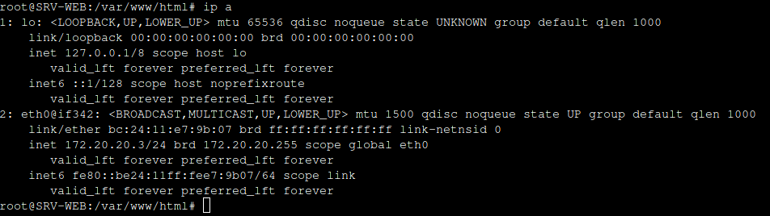
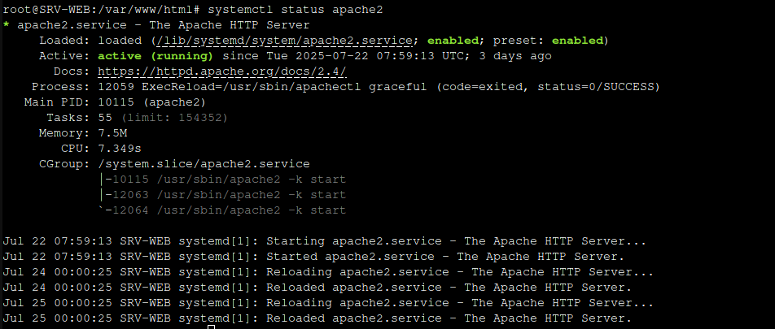
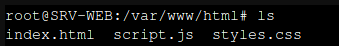

## Installation serveur web 

Nous allons avoir besoin d'une nouvelle machine pour notre serveur web. Ici nous allons créer un container et installer Debian dessus. 
Une fois créer nous allons nous assurer qu'elle fait bien partie du réseau avec la commande 
```bash
ip a
```


Mettre à jour la Debian avec :
```bash
sudo apt update && sudo apt upgrade -y
```
Puis installer **apache2** :
```bash
apt install apache2 -y
```
Pour être sur que **apache2** est bien installé : 
```bash
systemctl status apache2
```


Nous avons à présent une page web fonctionnel. Pour y accéder il suffit d'aller sur une machine ayant une interface graphique connecter à notre réseau (ici nous allons utiliser une machine Windows). Puis de taper dans la barre de recherche d'un navigateur web l'adresse ip de notre serveur web. 


Maintenant nous allons modifier cette page web pour qu'elle corresponde a un site web d'une entreprise. 
Pour cela nous allons retourner sur notre serveur web, et aller dans le repertoire : 
```bash
/var/www/html
```
Il devrait y avoir un fichier **index.html**. Nous allons le modifier completement. Une copie du code est disponible dans le dossier **Ressources**

Nous allons également ajouter deux fichiers dans le repertoire : **scripts.js** et **styles.css**.
Ces fichiers sont également disponible dans la partie **Ressources**. 

Une fois ces fichiers présents dans le repertoire, notre page web est terminé. 




## Configuration Routeur Vyos
<span id="Configuration_Routeur"/><span>
``conf``
``sh int``

``set interfaces ethernet eth0 address 172.16.20.253/24``
``set interfaces ethernet eth2 address 172.16.50.253/24``

``commit``
``save``
``reboot``

``conf``
``set protocols static route 172.16.20.0/24 next-hop 172.16.20.253``
``set protocols static route 172.16.50.0/24 next-hop 172.16.50.253``
``commit``
``save``

``configure``
``delete service dhcp-relay``
``commit``
``save``

``configure``

``set service dhcp-relay listen-interface eth2``
``set service dhcp-relay upstream-interface eth0``
``set service dhcp-relay server 172.16.20.3``

``commit``
``save``

``show configuration commands | match dhcp-relay`` (pour voir la conf si bien appliquée)

doit afficher:
``set service dhcp-relay listen-interface eth2``
``set service dhcp-relay upstream-interface eth0``
``set service dhcp-relay server 172.16.20.3``

redémarrer le service : ``systemctl restart dhcp-relay-agent``


